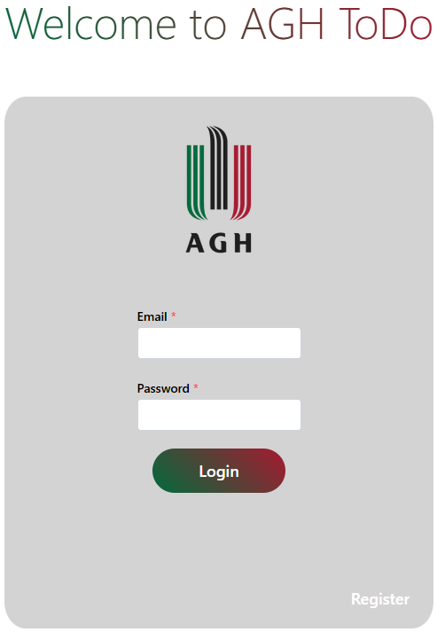
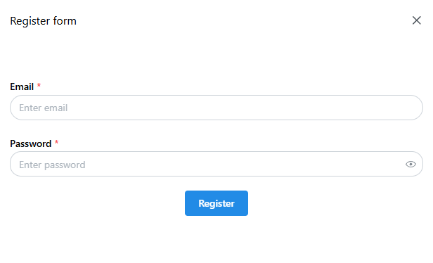
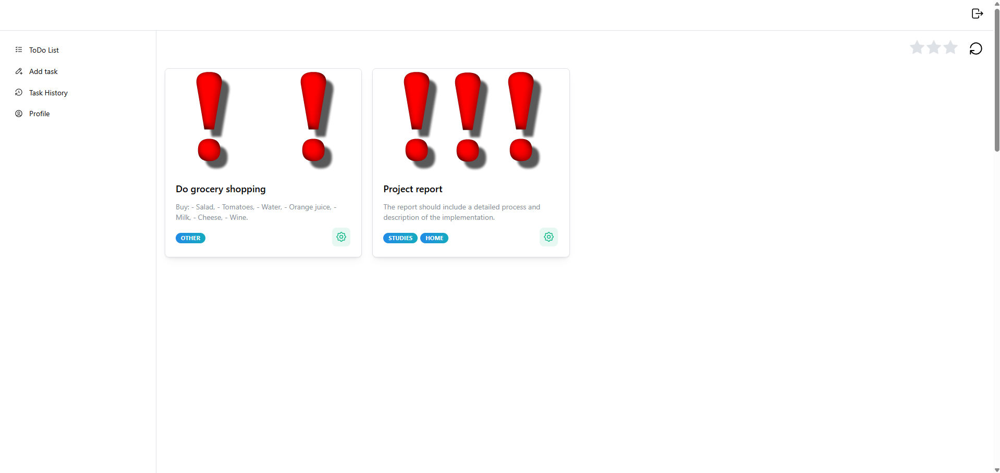
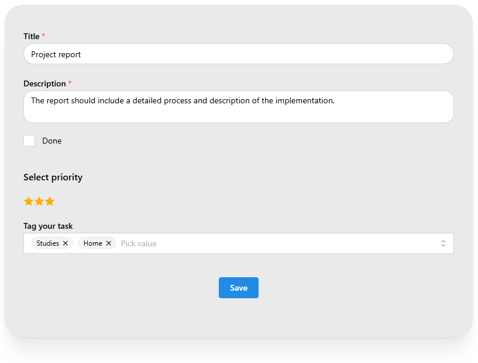
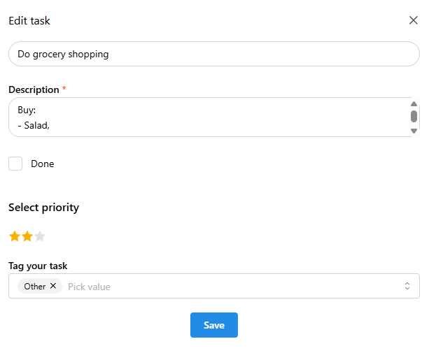
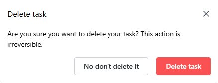

# ToDo Application

## Description

This project is a full-stack Todo application built using modern web technologies. The backend is powered by the [NestJS](https://nestjs.com/) framework, while the frontend is developed using [React](https://reactjs.org/) and [Vite](https://vitejs.dev/). The application allows users to manage their tasks efficiently with features such as task creation, updating, deletion, and categorization.

## Key Features

- **Task Management**: Create, update, delete, and categorize tasks.
- **User Authentication**: Secure user authentication and authorization using JWT.
- **Real-time Updates**: Real-time task updates using WebSockets.
- **Responsive Design**: Fully responsive design for optimal user experience on all devices.
- **Testing**: Comprehensive end-to-end testing.
- **Database Management**: Efficient database management with Prisma ORM.

## Technologies Used

### Backend
- NestJS
- Prisma
- JWT
- Argon2

### Frontend
- React
- Vite
- Mantine
- Cypress

## Project Setup

### Prerequisites

- Node.js (v16 or higher)
- npm (v7 or higher)

### Backend

1. Clone the repository:
    ```bash
    git clone https://github.com/WinterWollf/Todo.git
    ```

2. Navigate to the `backend` directory:
    ```bash
    cd Todo/backend
    ```

3. Install dependencies:
    ```bash
    npm install
    ```

4. Set up the database:
    ```bash
    npx prisma migrate dev --name init
    ```

5. Start the development server:
    ```bash
    npm run start:dev
    ```

### Frontend

1. Navigate to the `frontend` directory:
    ```bash
    cd Todo/frontend
    ```

2. Install dependencies:
    ```bash
    npm install
    ```
    If you encounter an error try adding `--legacy-peer-deps`

3. Start the development server:
    ```bash
    npm run dev
    ```

## Running Tests

### Frontend

- End-to-end tests:

    ```bash
    npm run cypress:open
    ```

## Deployment

For deployment instructions, please refer to the [NestJS deployment documentation](https://docs.nestjs.com/deployment) and the [Vite deployment guide](https://vitejs.dev/guide/static-deploy.html).

## Screenshots

Here are some screenshots showcasing the main features of the application:

### **Login page**


### **Register form**


### **Task liste**


### **Add task**


### **Task edit menue**


### **Delete confirmation**


## Resources

- [NestJS Documentation](https://docs.nestjs.com)
- [React Documentation](https://reactjs.org/docs/getting-started.html)
- [Vite Documentation](https://vitejs.dev/guide/)
- [Prisma Documentation](https://www.prisma.io/docs/)
- [Cypress Documentation](https://docs.cypress.io/)

## License

This project is licensed under the Creative Commons Attribution-NonCommercial 4.0 International (CC BY-NC 4.0) License - see the [LICENSE](LICENSE.txt) file for details.

## Contact

For any inquiries or feedback, feel free to reach out to the project author:
- **GitHub**: [WinterWollf](https://github.com/WinterWollf)

---
